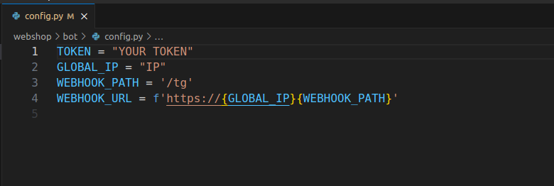

# Webshop

Webshop is a versatile Telegram bot designed to enable users to effortlessly set up and manage their own shops within the Telegram platform. With its user-friendly interface and flexible architecture, Webshop empowers users to create and customize their virtual stores with ease.

## Instalation

Create and activate virtual enviroment

```bash
python3 -m venv venv
source venv/bin/activate
```


Use the package manager [pip](https://pip.pypa.io/en/stable/) to install requirements.

```bash
pip3 install -r requirements.txt
```

## Configure

Create token using [BotFather](https://telegram.me/BotFather)

Now you need to create your telegram token and put it inside config.py.


Now they only step is to seed our database. In webshop mongodb is used, so make sure it's pre-installed on your pc.

```bash
python3 webshop/db/seeder.py
```

## Run

Now the only step is run webshop.

```bash
python3 main.py
```

## Demonstration


## License

[MIT](https://choosealicense.com/licenses/mit/)